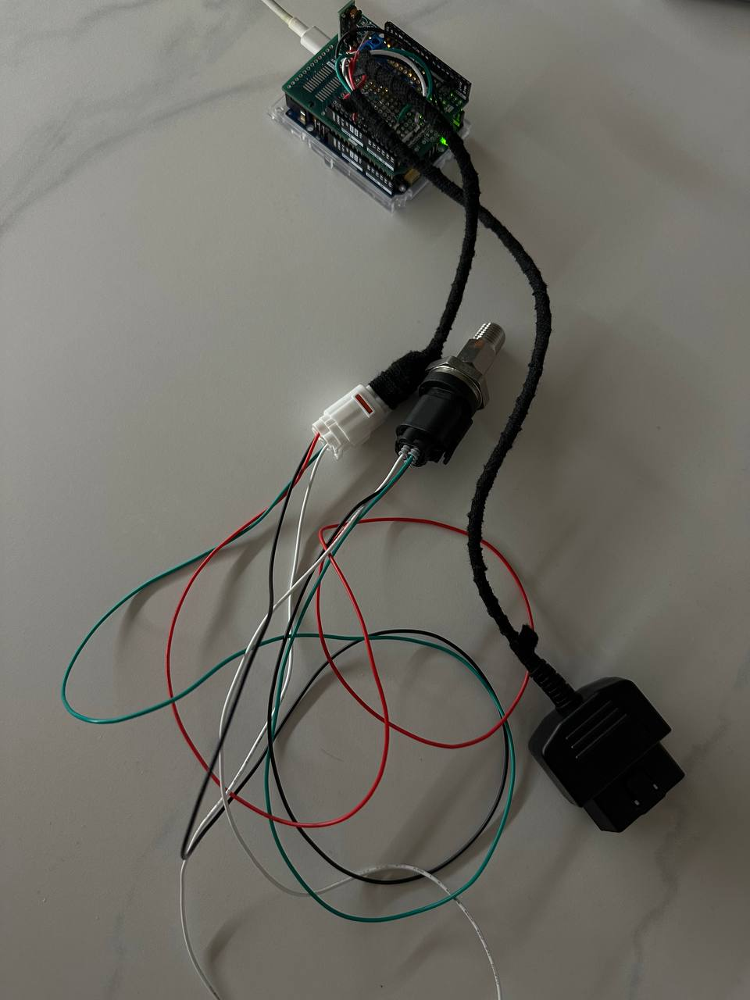

# miata-gate

## Description

The Mazda MX-5 NC has a significant issue with its sensors — it features a fake oil pressure sensor, and oil temperature
monitoring is entirely absent. This can lead to major problems, especially on the track, leaving you "blind" to critical
engine data.

This project's primary goal is to create an open-source "gate" that can sniff the CAN bus and forward the data to any
device using Wi-Fi or Bluetooth. Currently, the project integrates
with [RaceChrono DIY](https://racechrono.com/article/2572) via Bluetooth LE protocols and supports **CAN Bus**.
Check out a Roadmap for details.

A prototype example rev-v1.



This prototype, built on the Arduino UNO R4 Wi-Fi, includes an OBD2 connector and utilizes a 12V-to-5V converter.

### Sniffed CAN bus PIDs

I used [Mazda MX5 NC Can DB](https://github.com/timurrrr/RaceChronoDiyBleDevice/blob/master/can_db/mazda_mx5_nc.md) and
I believe many of PIDs are compatible with Mazda RX8. Some CAN PIDs are compatible
with [Mazda 3 (2nd gen)](https://docs.google.com/spreadsheets/d/1SKfXAyo6fbAfMUENw1KR3w4Fvx_Ihj6sTPSVXBdOXKk).

List of sniffed PIDs

* `0x201`
* `0x212`
* `0x231`
* `0x240`
* `0x420`
* `0x4B0`

## Disclaimer

The author is not responsible for any damage to or effects on your car. Proceed at your own risk.

## Requirements

### Software

* make
* [PlathformIO](https://platformio.org/install/cli)

### Hardware

* Arduino UNO R4 WI-FI
* Arduino UNO Proto Shield
* Bosch 0 261 230 482 Sensor
* Resistor 5 kΩ (5000 Ohms)
* Bosch trapezoid plug

## PCB

TODO: Add PCB or guide how to build

## Board flashing

```shell
make upload
```

### Debugging

You can enable verbose mode on your device, but keep in mind that it will significantly reduce its speed. Use this mode
for debugging purposes only.

```shell
BOARD_DEBUG=true make upload
```

### [Race Chrono setup](race-chrono-setup.md)

## Roadmap

- Add oil temperature and pressure streaming for OBD-II requests.
- Implement ESP32-S3 display integration to show critical information as an alternative to the onboard computer.
- Build an ESP32 CAN gate as a permanent solution.
- Add a PCB schematic to make the project easy to build for anyone.

## Open Source Projects That Influenced This Project

* [Mazda RX8 RaceChrono DIY](https://github.com/mickeynn/test)
* [RaceChronoDiyBleDevice](https://github.com/timurrrr/RaceChronoDiyBleDevice)
* [OBD2 header](https://github.com/sandeepmistry/arduino-OBD2/blob/master/src/OBD2.h)
* [Awesome CAN bus](https://github.com/iDoka/awesome-canbus)
* [awesome-automotive-can-id](https://github.com/iDoka/awesome-automotive-can-id)

## Useful links

* [Arduino UNO R4 WI-FI](https://store.arduino.cc/products/uno-r4-wifi)
* [Arduino UNO Proto Shield](https://store.arduino.cc/collections/shields-carriers/products/proto-shield-rev3-uno-size)
* [Bosch 0 261 230 482](https://spareto.com/products/bosch-sender-unit-oil-temperature-pressure/0-261-230-482)
* [Bosch 0 261 230 482 Specification](https://webshop.swindonpowertrain.com/image/catalog/datasheets/Pressure_Sensor_Combined_PST-F_1_Datasheet_51_en_23446188555.pdf)
* [OBD2 socket](https://a.aliexpress.com/_onJLZhV)
* [Bosch trapezoid plug](https://a.aliexpress.com/_onCN87l)
* [1/4 NPT male to M10 female](https://a.aliexpress.com/_omF4dqB)
